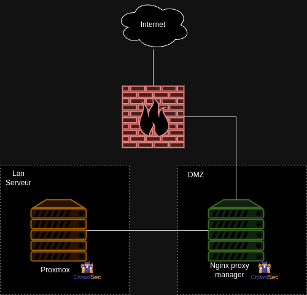

# Setting-Up-Proxmox-Nginx-Proxy-Manager-and-CrowdSec



## Installation de CrowdSec et Configuration sur nos Serveurs Proxmox et Nginx Proxy Manager

Pour installer CrowdSec, utilisez la commande suivante sur vos deux serveurs. Pour plus de détails, consultez le site officiel [ici](https://docs.crowdsec.net/docs/getting_started/install_crowdsec/).

```sh
curl -s https://install.crowdsec.net | sudo sh
```

Ensuite, installez CrowdSec avec :

```shell
apt install crowdsec
```

Dans notre projet, l'objectif est d'utiliser CrowdSec en multiserveur pour synchroniser les alertes et les listes de bannissement d'IP. Pour cela, notre serveur Nginx Proxy Manager jouera le rôle d'hôte local API pour centraliser les agents CrowdSec. Nous n'en aurons qu'un dans notre cas.

### Configuration de CrowdSec sur le Serveur Nginx Proxy Manager

Configurez le serveur Nginx Proxy Manager comme un hôte local API pour CrowdSec en modifiant le fichier `/etc/crowdsec/config.yaml` pour qu'il écoute sur toutes les IPs :

```yaml
listen_uri: 0.0.0.0:8080
```

#### Configuration de CrowdSec sur le Serveur Proxmox

Maintenant, passons à la configuration sur le serveur Proxmox. Dans un premier temps, désactivez l'API de CrowdSec pour qu'il agisse comme un agent CrowdSec :

Dans le fichier `/etc/crowdsec/config.yaml` :

```yaml
server:
   enable: false  # Mettez cette ligne à false
   log_level: info
   # listen_uri: 127.0.0.1:8080 (commentez cette ligne)
```

Ensuite, inscrivez votre serveur Proxmox sur l'hôte local API, qui est notre serveur Nginx Proxy Manager dans ce cas :

```bash
cscli lapi register -u http://<ip_serveurLocalApi>:8080 --machine --name proxmox
```

Assurez-vous de remplacer `<ip_serveurLocalApi>` par l'adresse IP de votre serveur Nginx Proxy Manager. L'option `--machine` permet de nommer l'agent pour une meilleure identification.

Redémarrez CrowdSec pour appliquer les changements :

```bash
systemctl restart crowdsec
```

### Ajout de l'Agent sur le Serveur Local API (Nginx Proxy Manager)

Pour voir les agents ajoutés ou en attente d'acceptation, utilisez la commande :

```bash
cscli machines list
```

Vous devriez obtenir quelque chose comme ceci :

```bash
Name        IP Address        Last Update             Status  Version                                       Auth Type  Last Heartbeat
proxmox     192.168.20.287    2024-07-14T11:10:48Z    X       v1.6.2-debian-pragmatic-amd64-16bfab86-linux   password   15s
```

Pour accepter l'agent, utilisez :

```bash
cscli machines validate proxmox
```

Maintenant, déclarez votre Proxmox comme un bouncer pour permettre l'ajout d'alertes ou de décisions de blocage d'IP. Créez une clé API avec :

```bash
cscli bouncers add proxmox
```

Vous obtiendrez une clé API que vous ajouterez dans le fichier de configuration des bouncers sur votre Proxmox, généralement situé à `/etc/crowdsec/bouncers/crowdsec-firewall-bouncer.yaml` :

```yaml
api_url: http://<ip_du_serveur_nginx_local_api>:8080
api_key: <your_api_key>
```

Redémarrez ensuite CrowdSec pour appliquer ces modifications :

```bash
systemctl restart crowdsec
```

---

### Configuration des bouncers CrowdSec pour bloquer et détecter les attaques sur Proxmox

Pour configurer CrowdSec afin qu'il récupère les logs de connexion de Proxmox, vous devez éditer le fichier `/etc/crowdsec/acquis.yaml`.

Ajoutez le code suivant à la fin du fichier :

```yaml
---
# Acquisition des logs via journalctl pour pvedaemon
source: journalctl
journalctl_filter:
  - _SYSTEMD_UNIT=pvedaemon.service
labels:
  type: syslog
---
```

Pour ajouter les bouncers CrowdSec pour Proxmox, visitez la page du hub de CrowdSec à l'adresse suivante : [Collection Proxmox sur le hub de CrowdSec](https://app.crowdsec.net/hub/author/fulljackz/collections/proxmox).

Pour installer les bouncers sur votre instance Proxmox, exécutez la commande suivante :

```bash
cscli collections install fulljackz/proxmox
```

Pour configurer les bouncers, modifiez le fichier `/etc/crowdsec/scenarios/proxmox-bf.yaml` selon vos besoins et configurations spécifiques.

N'oubliez pas de redémarrer CrowdSec pour que cela soit pris en compte ` systemctl restart crowdsec` . Vous devriez obtenir ceci pour confirmer que CrowdSec récupère bien les logs d'authentification de Proxmox avec la commande `cscli metrics` :

```
╭───────────────────────────────────────────────────────┬────────────┬──────────────┬────────────────┬────────────────────────┬───────────────────╮
│                          Source                       │ Lines read │ Lines parsed │ Lines unparsed │ Lines poured to bucket │ Lines whitelisted │
├───────────────────────────────────────────────────────┼────────────┼──────────────┼────────────────┼────────────────────────┼───────────────────┤
│ journalctl:journalctl-_SYSTEMD_UNIT=pvedaemon.service │ 213        │ 29           │ 184            │ 27                       │ 2                 │
╰───────────────────────────────────────────────────────┴────────────┴──────────────┴────────────────┴────────────────────────┴───────────────────╯
```

---

## Configuration de Nginx Proxy Manager Docker avec CrowdSec

Je me suis basé sur cet article très bien fait pour le mettre en place : [CrowdSec avec Nginx Proxy Manager](https://www.crowdsec.net/blog/crowdsec-with-nginx-proxy-manager).

Sur la machine en amont de mon Proxmox qui accueillera mon Nginx Proxy Manager, j'ai installé Docker avec un fork de Nginx Proxy Manager qui inclut directement "OpenResty CrowdSec Bouncer" : https://github.com/crowdsecurity/cs-openresty-bouncer. Cela ajoute une sécurité supplémentaire et remplace/renforce Fail2Ban. Dans notre cas, c'est obligatoire pour que Nginx Proxy Manager puisse bloquer les IPs suite à des échecs de connexion ou des tentatives de force brute sur notre Proxmox derrière notre reverse proxy.

Voici le fichier Docker Compose. Afin d’éviter d'avoir les mots de passe en clair dans le code, je conseille de créer des variables d'environnement.

Créez un fichier `.env` :

```env
# .env

DB_MYSQL_PASSWORD=<password>
MYSQL_ROOT_PASSWORD=<password>
MYSQL_USER_PASSWORD=<password>
```

J'ai créé un répertoire à la racine pour mon Docker Nginx Proxy Manager `/npm` :

```yaml
version: "3.8"
services:
  app:
    image: 'lepresidente/nginxproxymanager:latest'
    restart: unless-stopped
    ports:
      - '80:80'   # Public HTTP Port
      - '443:443' # Public HTTPS Port
      - '81:81'   # Admin Web Port
    environment:
      DB_MYSQL_HOST: "db"
      DB_MYSQL_PORT: 3306
      DB_MYSQL_USER: "npm"
      DB_MYSQL_PASSWORD: "${DB_MYSQL_PASSWORD}"
      DB_MYSQL_NAME: "npm"
      
    volumes:
      - /npm/data/nginx:/data
      - /npm/data/letsencrypt:/etc/letsencrypt
    depends_on:
      - db

  db:
    image: 'jc21/mariadb-aria:latest'
    restart: unless-stopped
    environment:
      MYSQL_ROOT_PASSWORD: "${MYSQL_ROOT_PASSWORD}"
      MYSQL_DATABASE: 'npm'
      MYSQL_USER: 'npm'
      MYSQL_PASSWORD: "${MYSQL_USER_PASSWORD}"
    volumes:
      - /npm/data/mysql:/var/lib/mysql
```

Vérifier  `/etc/crowdsec/config.yaml` pour qu'il écoute sur toutes les IPs : (Normalement, cela a déjà été fait à l'étape précédente.)

```yaml
listen_uri: 0.0.0.0:8080
```


Ensuite, redémarrez CrowdSec :

```bash
sudo systemctl restart crowdsec
```

Créez une clé API pour le conteneur NPM :

```bash
sudo cscli bouncers add npm-proxy
```

Déployez le Docker pour qu'il crée les fichiers de configuration, puis modifiez le fichier `/npm/data/nginx/crowdsec/crowdsec-openresty-bouncer.conf` :

```bash
ENABLED=true
API_URL=http://<ip_local>:8080
API_KEY=<your_api_key>
```

Redémarrez Docker Compose :

```bash
docker-compose restart
```

Vous pouvez vérifier les logs pour vous assurer que la configuration est correcte :

```bash
docker logs --follow <container_name>
```

Vous devriez voir une ligne comme celle-ci :

```bash
nginx: [alert] [lua] init_by_lua:11: [Crowdsec] Initialization done
```

Ensuite, installez la collection CrowdSec pour Nginx Proxy Manager sur la machine directement :

```bash
sudo cscli collections install crowdsecurity/nginx-proxy-manager
```

Et relancez CrowdSec :

```bash
sudo systemctl reload crowdsec
```

---
## Résolution du problème d'IP client avec Proxmox derrière un Reverse Proxy

Lorsque Proxmox est derrière un reverse proxy, il est crucial de s'assurer que Proxmox récupère l'IP réelle du client externe et non celle du reverse proxy. Cela permet d'identifier correctement les sources des échecs d'authentification et d'autres événements. Voici comment configurer cela :

### Configuration de Nginx Reverse Proxy Manager

Pour que Nginx transmette la véritable IP du client externe à Proxmox, vous devez définir des en-têtes spécifiques dans le proxy host qui pointe vers Proxmox.

#### Définir la location

1. Définissez où se situe le site. Dans ce cas, il est à la racine, donc ajoutez `/`.
2. Dans le schéma (scheme), sélectionnez `https`.
3. Définissez `Forward Hostname / IP*` avec l'IP de Proxmox.
4. Définissez `Forward Port` avec le port par défaut de Proxmox, qui est `8006`.

Ajoutez les en-têtes suivants à la configuration :

```nginx
proxy_set_header Host $host;
proxy_set_header X-Real-IP $remote_addr;
proxy_set_header X-Forwarded-For $proxy_add_x_forwarded_for;
proxy_set_header X-Forwarded-Proto $scheme;
```

### Explications des en-têtes

1. **`proxy_set_header Host $host;`**
    - **Fonction :** Définit l'en-tête `Host` avec le nom de l'hôte de la requête initiale.
    - **Utilisation :** Permet au serveur backend de savoir pour quel nom de domaine la requête a été faite.

2. **`proxy_set_header X-Real-IP $remote_addr;`**
    - **Fonction :** Définit l'en-tête `X-Real-IP` avec l'adresse IP du client d'origine.
    - **Utilisation :** Utile pour l'authentification et la journalisation.

3. **`proxy_set_header X-Forwarded-For $proxy_add_x_forwarded_for;`**
    - **Fonction :** Ajoute l'adresse IP du client d'origine à l'en-tête `X-Forwarded-For`.
    - **Utilisation :** Permet de suivre la chaîne de proxies par laquelle la requête a transité.

4. **`proxy_set_header X-Forwarded-Proto $scheme;`**
    - **Fonction :** Définit l'en-tête `X-Forwarded-Proto` avec le schéma de la requête d'origine (HTTP ou HTTPS).
    - **Utilisation :** Permet de savoir si la requête d'origine était sécurisée ou non.

### Problème persistant

Même après avoir configuré les en-têtes, vous pourriez voir l'IP du reverse proxy dans les logs de Proxmox lors des échecs d'authentification.

Pour vérifier les échecs de connexion, utilisez la commande suivante :

```bash
journalctl -u pvedaemon.service -f
```

Vous verrez quelque chose comme ceci :

```logs
Jul 14 11:45:04 PVE-N01 pvedaemon[2720078]: authentication failure; rhost=::ffff:192.168.20.200 user=user@pam msg=no such user ('user@pam')
```

### Modification du comportement de Proxmox

Pour que Proxmox renvoie l'IP réelle du client, modifiez le fichier `/usr/share/perl5/PVE/APIServer/AnyEvent.pm` à la ligne 1484 en ajoutant le code suivant :

**Remarque :** Ce code a été obtenu avec l'aide de Mistral AI.

```perl
elsif ($path =~ m/^\Q$base_uri\E/) {  
    my $token = $request->header('CSRFPreventionToken');  
    my $cookie = $request->header('Cookie');  
    my $auth_header = $request->header('Authorization');

	<--- code a rajouter ligne 1484 

    if (my $x_forwarded_for = $request->header('X-Forwarded-For')) {
        my $proxy_count = 2;  # Ajustez en fonction de votre configuration (ex : Cloudflare + Nginx local)
        my @ip_list = reverse split /\s*,\s*/, $x_forwarded_for;

        for my $ip (@ip_list) {
            if (--$proxy_count < 0) {
                my $ip_parsed = Net::IP->new($ip);

                if ($ip_parsed) {
                    $reqstate->{peer_host} = $ip_parsed->version() == 4 ? "::ffff:$ip" : $ip;
                } else {
                    warn "IP malformée dans l'en-tête X-Forwarded-For. Vérifiez votre configuration de proxy ou \$proxy_count.\n";
                }
                last;
            }
        }

        warn "Erreur : Nombre insuffisant d'IP valides dans l'en-tête X-Forwarded-For. Vérifiez votre configuration de proxy ou \$proxy_count.\n" if $proxy_count >= 0;
    }
    
	---->
}
```

### Redémarrage du service

Après avoir ajouté le code, redémarrez le service `pveproxy.service` :

```shell
systemctl restart pveproxy.service
```


